# WakeLink with Alexa: step-by-step guide

[English](ALEXA.en.md) | [Espanol](ALEXA.es.md) | [Install WakeLink first](GETTING_STARTED.en.md)

**Status: beta; not yet tested end to end with a real Echo.** WakeLink does not connect to Alexa directly. The route is **WakeLink PC -> Home Assistant -> Matterbridge -> Alexa**. Matterbridge and its `matterbridge-hass` plugin are separate software and must keep running on the Home Assistant host when the PC is off. There is no third-party subscription, but Alexa may need the internet for voice recognition.

You need a PC already paired with WakeLink in Home Assistant, Home Assistant OS with the **Apps** menu (formerly **Add-ons**), a [Matter-compatible Echo](https://developer.amazon.com/docs/alexaplus/smarthome/matter-support.html), and the Alexa phone app. Echo and Home Assistant must be discoverable on the local network. **You do not need Home Assistant's Matter integration:** it imports Matter devices into Home Assistant, not your PC into Alexa.

There are **two different codes**: WakeLink's **six-digit code** pairs the PC with Home Assistant; Matterbridge's **Matter QR code** pairs the bridge with Alexa. Do not scan the QR before step 6.

These are real screenshots. **Red boxes** show exactly where to click or type. Your screen may differ with your Home Assistant version. For safety, no QR, token, or private network address is shown.

## 1. Check the PC and make a backup

1. Follow [the WakeLink installation guide](GETTING_STARTED.en.md) if the PC is not yet under **Settings > Devices & services > WakeLink**.
2. Open that PC and find its **power switch**. Open the entity details and note its **ID**, for example `switch.my_pc_power`. It must start with `switch.`. Do not toggle it just to inspect it: switching it off may shut down the PC.
3. Make a backup under **Settings > System > Backups**. Keep its encryption key private.
4. If you already share this PC with Alexa through Emulated Hue, remove that exposure first to avoid a duplicate. If **Matterbridge is already paired with Alexa**, do not follow this first-install recipe: a new unfiltered plugin could share unrelated devices. Set a safe filter before connecting it, or use an isolated instance.

**Checkpoint:** you have the exact `switch.` ID and a backup.

## 2. Install and open Matterbridge

1. In Home Assistant open **Settings > Apps > App store**. Older versions call **Apps** **Add-ons**.
2. Open **... > Repositories**, paste `https://github.com/Luligu/matterbridge-home-assistant-addon`, and select **Add**. This is the [official repository](https://github.com/Luligu/matterbridge-home-assistant-addon).

   First select the **three dots**, then **Repositories**:

   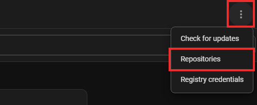

   Paste the address into the outlined field and select **Add**:

   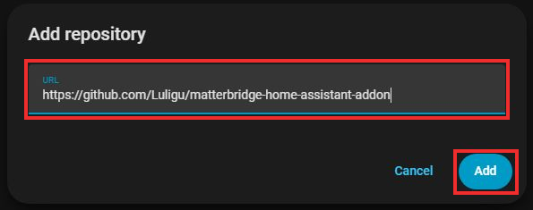

3. Find **Matterbridge**, select **Install**, and wait. Enable **Start on boot** so it runs when the PC is off. Select **Start** and **Open Web UI**. The first start may take several minutes; if the app is not ready, wait and retry.
4. The top navigation says **Home | Devices | Logs | Settings**. **Home** may show a QR code or a **Turn on pairing** button. Do not pair anything yet.

**Checkpoint:** Matterbridge opens and **Home** contains **Install plugins**. If not, check its app logs in Home Assistant.

## 3. Select the correct network

1. In another Home Assistant tab open **Settings > System > Network**. Note the name of the primary interface with your home-network address. It might be `end0`, `eth0`, or something else: do not blindly copy an example.
2. In Matterbridge select **Settings** at the top and find **Matter settings > Mdns interface**. Enter that exact name. Save and restart Matterbridge if prompted.

   Select **Settings** and type your interface name into **Mdns interface**; the field is empty in this screenshot:

   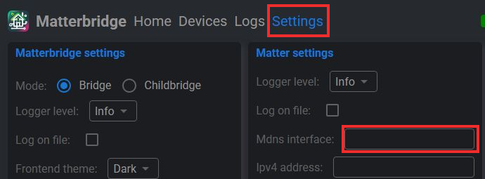

**Checkpoint:** on **Home > System info**, **Interface name** matches that network. If Matterbridge warns you to set **Mdns interface**, go back to **Settings** and fix it before pairing. A guest network isolating your Echo may prevent discovery.

## 4. Mark only the PC switch

1. In Home Assistant open **Settings > Devices & services > Entities**. Search for the `switch.` ID from step 1, open your PC's **Power** row, and select the entity **Settings** icon. Do not press the **Toggle** switch.
2. In that entity's settings, select **Add label**. If `WakeLink Alexa` already exists, select it. Otherwise select **Add new label...** and create it with that exact name; capitalization and spaces matter.

   In this crop, select **Add label** first, then **Add new label...**:

   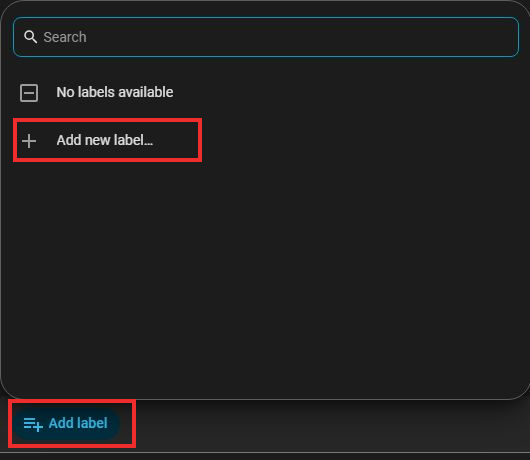

   Type this exact name into **Name** and then select **Create**:

   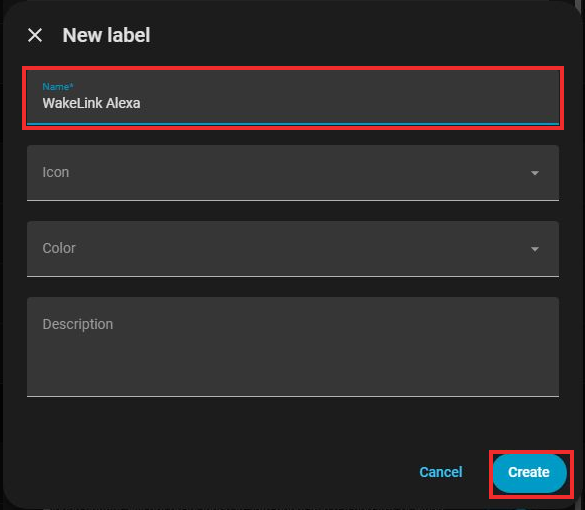

3. Confirm that `WakeLink Alexa` appears on **that entity** and select **Update** if it becomes enabled. If creating the label did not assign it automatically, open **Add label** again and select it. **Do not** label the whole device, an area, or other entities.

**Checkpoint:** the label identifies one entity. It is the filter before anything is shared with Alexa.

## 5. Install the plugin and limit what it exports

1. Under **Matterbridge > Home > Install plugins**, enter `matterbridge-hass` in **Plugin name or plugin path**, leave **Tag or version** at `latest`, and select **Install**. Wait for it to appear under **Plugins**. It may show **Error** until you enter Host and Token; this is expected. **Do not scan the QR.**

   Type `matterbridge-hass` in the left field and select **Install**:

   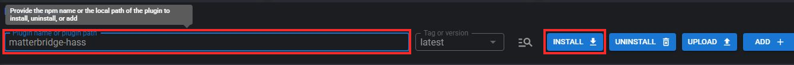

2. In Home Assistant select your username in the lower-left corner, then **Security > Long-Lived Access Tokens > Create token**. Name it, for example, `Matterbridge WakeLink`. Copy it when created. This credential gives broad Home Assistant access: never paste it into WakeLink, GitHub, screenshots, or chats.

   Scroll down in **Security** and select **Create token**. An existing token is hidden in this crop for privacy:

   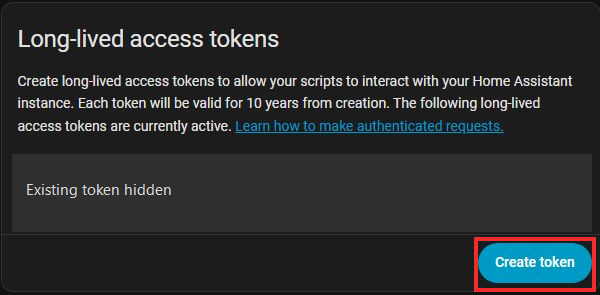

   Enter a name and select **Create token**. Copy the token from the *next* screen; it will not be shown again:

   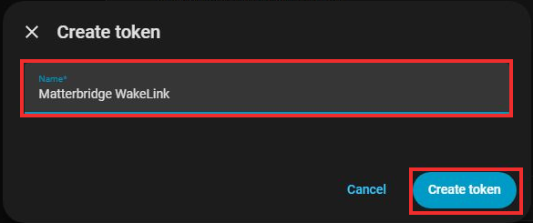

3. In the **Plugins** row for `matterbridge-hass`, select the small **gear** under **Actions** to open **Plugin config**:

   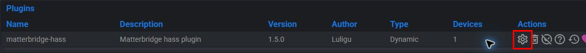

   Set **Host** to your Home Assistant WebSocket address, usually `ws://homeassistant.local:8123` on a trusted private LAN. Paste the new key into **Token**; never put it in a screenshot. This picture deliberately shows an empty Token field:

   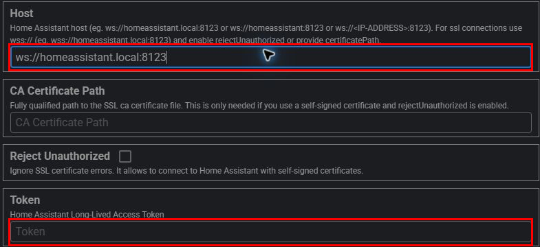

   `ws://` does not encrypt the token: use it only on a trusted local network. If Home Assistant uses HTTPS with a valid certificate, use `wss://` with its real hostname and select **Reject Unauthorized**. A self-signed certificate needs a trusted **CA Certificate Path**. Do not bypass certificate checks to hide an error.
4. Scroll down to **Filter By Label** and type exactly `WakeLink Alexa`:

   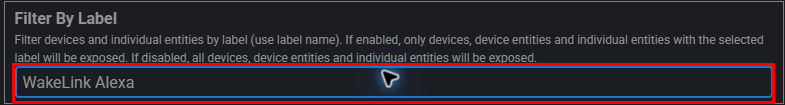

   Under **Domain Whitelist**, open the list and select **only** `switch`:

   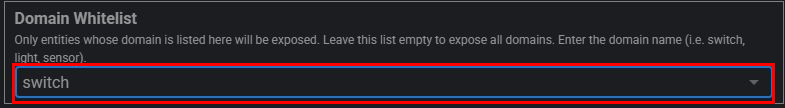

   Select **Confirm**, then **Restart matterbridge** (circular-arrow button in the top bar) and wait for it to return. Do not use **Split Entities**. Do not leave **Filter By Label** empty: without it, the plugin can export unrelated devices.
5. Open **Matterbridge > Devices**. At the upper right of **View mode**, select the **table icon**:

   

   The table must have **one row** from `matterbridge-hass`, named after your PC, and **Total devices: 1**. The name in this public picture is anonymized:

   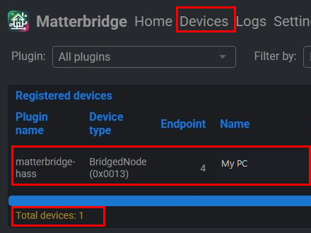

   In the icon view, the *same PC* may show two tiles, **Online** and **On**; that is not two exported PCs. If the table has zero rows, recheck Host, Token and label. If it has more than one, **do not pair Alexa**: fix the label/filter first.

**Required checkpoint:** do not move to the QR until the table shows only your intended PC. The plugin may expose many devices if incorrectly filtered.

## 6. Pair Matterbridge with Alexa

1. Open **Home** in Matterbridge. If you see **Turn on pairing**, select it now; otherwise the **QR pairing code** is already visible. It is not WakeLink's six-digit code. Do not publish the QR or manual code: someone on your network could try to pair the bridge.
2. On your phone open **Alexa > Devices > + > Add Device > Other > Matter**. Confirm the prompts and select **Scan QR Code**. Scan Matterbridge's QR. Button labels may change across Alexa versions; look for **Matter**.
3. Wait for Alexa to find the bridge and switch. Give the PC a clear name such as **Office PC**. If other Home Assistant devices appear, remove the bridge from Alexa, fix the step 5 filter, and do not test voice commands.
4. First check that the PC **appears** in Alexa. To test shutdown, save your work and say “Alexa, turn off Office PC.” Only if Wake-on-LAN already works from Home Assistant, test “Alexa, turn on Office PC” while the PC is off.

**Expected result:** one PC device in Alexa responding to both commands. Completing the guide does not prove this works: test it on a real Echo.

## If it fails or you want to undo it

- **Matterbridge is not ready:** wait, retry, and if it persists check its app logs in Home Assistant.
- **The Devices table shows zero:** check WakeLink, the label on the `switch.` *entity*, and Host/Token for `matterbridge-hass`.
- **The Devices table shows more than one row:** do not scan the QR. Remove extra labels or correct **Filter By Label**, restart Matterbridge, and count again.
- **Alexa cannot find it:** check **Mdns interface**, Echo Matter support, and local connectivity among Echo, phone, and Home Assistant.
- **Alexa cannot wake the PC:** first test Wake-on-LAN from Home Assistant. Matterbridge cannot change BIOS/UEFI or network-adapter settings.
- **Undo:** remove the Matterbridge bridge from Alexa, disable/uninstall `matterbridge-hass`, and **revoke its token** under **Home Assistant > your profile > Security**. You may remove the label. Keep your WakeLink PC and pairing. Restoring a backup does not revoke the token or remove Alexa's device by itself.

Sources: [Matterbridge app](https://github.com/Luligu/matterbridge-home-assistant-addon/blob/main/DOCS.md), [`matterbridge-hass` configuration](https://github.com/Luligu/matterbridge-hass/blob/main/README.md), [Home Assistant labels](https://www.home-assistant.io/docs/organizing/labels/), [Amazon Matter support](https://developer.amazon.com/docs/alexaplus/smarthome/matter-support.html).
