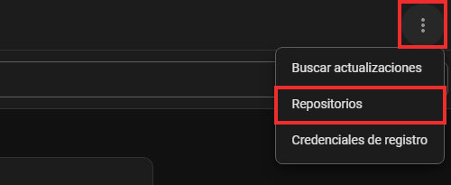
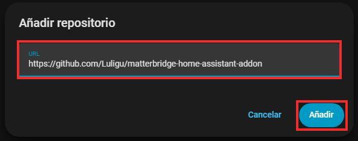
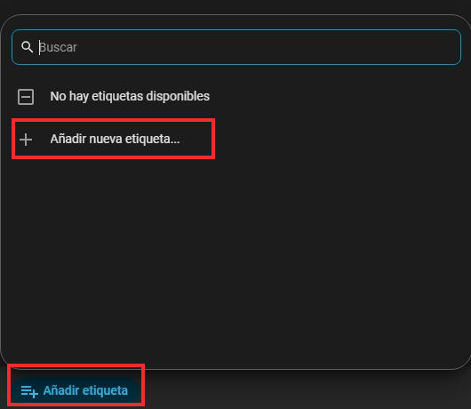
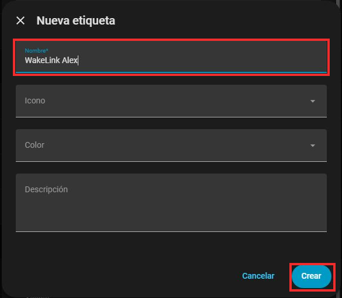
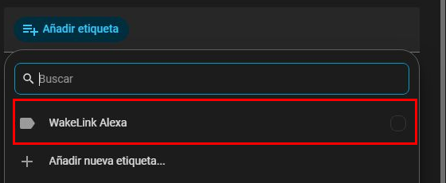
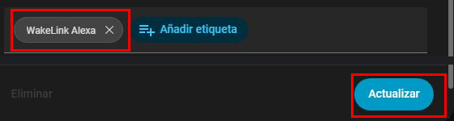
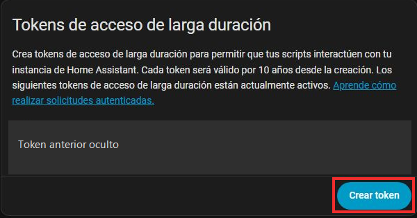
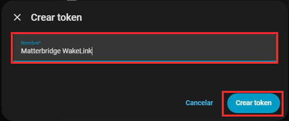

# WakeLink con Alexa: guia paso a paso

[English](ALEXA.en.md) | [Espanol](ALEXA.es.md) | [Instalar WakeLink primero](GETTING_STARTED.es.md)

**Estado: beta; aun no se ha probado de principio a fin con un Echo real.** WakeLink no se conecta directamente con Alexa. El recorrido es **PC con WakeLink -> Home Assistant -> Matterbridge -> Alexa**. Matterbridge y su complemento `matterbridge-hass` son independientes y deben seguir funcionando en Home Assistant cuando el PC este apagado. No hay suscripcion de terceros, pero Alexa puede necesitar Internet para entender la voz.

Necesitas el PC ya vinculado a WakeLink en Home Assistant, Home Assistant OS con el menu **Aplicaciones** (antes **Complementos**), un [Echo compatible con Matter](https://developer.amazon.com/docs/alexaplus/smarthome/matter-support.html) y la app Alexa en el movil. Echo y Home Assistant deben verse en la red local. **No necesitas instalar la integracion Matter de Home Assistant:** sirve para recibir dispositivos Matter, no para publicar este PC en Alexa.

Hay **dos codigos distintos**: el codigo de **seis cifras de WakeLink** vincula el PC con Home Assistant; el **QR Matter de Matterbridge** vincula el puente con Alexa. No escanees el QR hasta el paso 6.

Las capturas de esta guia son reales. Los **recuadros rojos** indican donde pulsar o escribir. Tu pantalla puede variar segun la version de Home Assistant. Por seguridad, no mostramos ningun QR, token ni direccion privada.

## 1. Comprueba el PC y haz una copia

1. Sigue [la instalacion de WakeLink](GETTING_STARTED.es.md) si todavia no ves el PC en **Configuracion > Dispositivos y servicios > WakeLink**.
2. Abre ese PC y localiza su **interruptor de encendido**. Abre los detalles de la entidad y apunta su **ID**, por ejemplo `switch.mi_pc_power`. Debe empezar por `switch.`. No pulses el interruptor para mirar si funciona: pasarlo a apagado puede apagar el PC.
3. Crea una copia en **Configuracion > Sistema > Copias de seguridad**. Conserva su clave de cifrado en privado.
4. Si ya compartias ese PC con Alexa mediante Emulated Hue, quita primero esa exposicion para evitar duplicados. Si **Matterbridge ya esta vinculado a Alexa**, no sigas esta receta de primera instalacion: un complemento nuevo sin filtrar podria compartir otros dispositivos. Configura un filtro seguro antes de conectarlo o usa una instancia aislada.

**Comprueba antes de seguir:** tienes el ID exacto del `switch.` y la copia de seguridad.

## 2. Instala y abre Matterbridge

1. En Home Assistant abre **Configuracion > Aplicaciones > Tienda de aplicaciones**. En versiones antiguas, **Aplicaciones** se llama **Complementos**.
2. Abre el menu **... > Repositorios**, pega `https://github.com/Luligu/matterbridge-home-assistant-addon` y pulsa **Anadir**. Es el [repositorio oficial](https://github.com/Luligu/matterbridge-home-assistant-addon).

   Primero pulsa los **tres puntos** y despues **Repositorios**:

   

   Pega la direccion en el campo marcado y pulsa **Anadir**:

   

3. Busca **Matterbridge**, pulsa **Instalar** y espera. Activa **Iniciar al arrancar** para que funcione con el PC apagado. Pulsa **Iniciar** y **Abrir interfaz web**. El primer inicio puede tardar varios minutos; si aparece «La aplicacion no esta lista», espera y pulsa **Volver a intentar**.
4. Arriba veras **Home | Devices | Logs | Settings**. **Home** puede mostrar un QR o el boton **Turn on pairing**. Todavia no vincules nada.

**Comprueba:** la interfaz abre y en **Home** aparece **Install plugins**. Si no, revisa el registro de la aplicacion en Home Assistant.

## 3. Selecciona la red correcta

1. En otra pestana de Home Assistant abre **Configuracion > Sistema > Red**. Apunta el nombre de la interfaz principal que tiene la direccion de tu red domestica. Puede ser `end0`, `eth0` u otro: no copies un ejemplo a ciegas.
2. Vuelve a Matterbridge, pulsa **Settings** arriba y busca **Matter settings > Mdns interface**. Escribe exactamente ese nombre. Guarda y reinicia Matterbridge si lo pide.

   Pulsa **Settings** y escribe el nombre de tu interfaz en **Mdns interface**; el campo aparece vacio en esta captura:

   

**Comprueba:** en **Home > System info**, **Interface name** corresponde a esa red. Si Matterbridge avisa de que falta **Mdns interface**, vuelve a **Settings** y corrigelo antes de vincular Alexa. Una red de invitados que aisle el Echo puede impedir la deteccion.

## 4. Marca solo el interruptor del PC

1. En Home Assistant abre **Configuracion > Dispositivos y servicios > Entidades**. Busca el ID `switch.` del paso 1, abre la fila **Power** de tu PC y pulsa el icono **Configuracion** de la entidad. No pulses el interruptor **Alternar**.
2. En los ajustes de **Power**, pulsa **Anadir etiqueta**. Si **no aparece** `WakeLink Alexa` en la lista, pulsa **Anadir nueva etiqueta...**, escribe `WakeLink Alexa` y pulsa **Crear**. Si ya aparece, no crees otra.

   **Solo si no existe**, pulsa **Anadir nueva etiqueta...**:

   

   Escribe exactamente este nombre en **Nombre** y pulsa **Crear**:

   

3. Mira junto a **Anadir etiqueta**. Si ya ves una pastilla **WakeLink Alexa**, pasa al paso 4. **Si no la ves**, abre **Anadir etiqueta** y pulsa la opcion **WakeLink Alexa**. Crear la etiqueta no garantiza que quede asignada a **Power**; tampoco la pulses dos veces porque podrias desmarcarla.

   Si falta la pastilla, pulsa **WakeLink Alexa**, la opcion marcada en rojo; **no** pulses **Anadir nueva etiqueta...** otra vez:

   

4. Comprueba que aparezca la pastilla **WakeLink Alexa** junto a **Anadir etiqueta**. Despues pulsa **Actualizar** abajo; si no lo pulsas, el cambio no se guarda.

   Estos dos recortes son del mismo formulario: primero la pastilla, despues **Actualizar**:

   

**Comprueba antes de seguir:** vuelve a **Entidades** y busca el PC. La fila **Power** debe mostrar **WakeLink Alexa** junto a su nombre. Si no aparece, repite los pasos 3 y 4; **no sigas a Matterbridge**. No apliques la etiqueta al dispositivo completo, a un area ni a otras entidades.

## 5. Instala el complemento y limita lo que exporta

1. En **Matterbridge > Home > Install plugins**, escribe `matterbridge-hass` en **Plugin name or plugin path**, deja **Tag or version** en `latest` y pulsa **Install**. Espera a que aparezca en **Plugins**. Puede indicar **Error** hasta que rellenes Host y Token; es normal. **No escanees el QR.**

   Escribe `matterbridge-hass` en el campo de la izquierda y pulsa **Install**:

   

2. En Home Assistant pulsa tu usuario, abajo a la izquierda, y entra en **Seguridad > Tokens de acceso de larga duracion > Crear token**. Llamalo, por ejemplo, `Matterbridge WakeLink`. Copialo al crearlo. Es una clave con acceso amplio a Home Assistant: no la pongas en WakeLink, GitHub, capturas ni chats.

   Baja hasta **Tokens de acceso de larga duracion** y pulsa **Crear token**. Hemos ocultado un token anterior en este recorte:

   

   Escribe un nombre y pulsa **Crear token**. Copia el token de la pantalla *siguiente*: no volvera a mostrarse:

   

3. En la fila **Plugins** de `matterbridge-hass`, pulsa el **engranaje** de **Actions** para abrir **Plugin config**:

   

   En **Host** pon la direccion WebSocket de Home Assistant, normalmente `ws://homeassistant.local:8123` en una red privada de confianza. Pega la nueva clave en **Token**; nunca la incluyas en una captura. En esta imagen el campo Token esta vacio a proposito:

   

   `ws://` no cifra el token: usalo solo en una red local de confianza. Si Home Assistant usa HTTPS con certificado valido, usa `wss://` con su nombre real y marca **Reject Unauthorized**. Un certificado propio necesita un **CA Certificate Path** de confianza. No desactives la comprobacion del certificado para ocultar un error.
4. Baja hasta **Filter By Label** y escribe exactamente `WakeLink Alexa`:

   

   En **Domain Whitelist**, abre la lista y selecciona **solo** `switch`:

   

   Pulsa **Confirm** y despues **Restart matterbridge** (boton de flecha circular en la barra superior); espera a que vuelva a abrir. No uses **Split Entities**. No dejes **Filter By Label** vacio: sin el, el complemento puede exportar otros dispositivos.
5. Abre **Matterbridge > Devices**. En **View mode**, arriba a la derecha, pulsa el **icono de tabla**:

   

   La tabla debe tener **una fila** de `matterbridge-hass`, con el nombre de tu PC, y mostrar **Total devices: 1**. En esta captura publica hemos ocultado el nombre real:

   

   En la vista de tarjetas, el *mismo PC* puede aparecer dos veces como **Online** y **On**; no son dos PC exportados. Si la tabla no tiene filas, revisa Host, Token y etiqueta. Si hay mas de una, **no vincules Alexa**: corrige la etiqueta o el filtro.

**Comprobacion obligatoria:** no vayas al QR hasta que la tabla muestre solo tu PC. Un filtro mal configurado puede exportar muchos dispositivos.

## 6. Vincula Matterbridge con Alexa

1. En Matterbridge abre **Home**. Si aparece **Turn on pairing**, pulsalo ahora; si no, ya veras **QR pairing code**. No es el codigo de seis cifras de WakeLink. No publiques el QR ni el codigo manual: alguien en tu red podria intentar vincular el puente.
2. En el movil abre **Alexa > Dispositivos > + > Anadir dispositivo > Otro > Matter**. Confirma las preguntas y pulsa **Escanear codigo QR**. Escanea el QR de Matterbridge. Los textos pueden variar segun la version de Alexa; busca la opcion **Matter**.
3. Espera a que Alexa encuentre el puente y el interruptor. Dale al PC un nombre claro, como **PC del despacho**. Si aparecen otros dispositivos de Home Assistant, elimina el puente de Alexa, corrige el filtro del paso 5 y no pruebes ordenes de voz.
4. Primero comprueba que el PC **aparece** en Alexa. Para probar el apagado, guarda tu trabajo y di «Alexa, apaga PC del despacho». Solo si Wake-on-LAN ya funciona desde Home Assistant, prueba «Alexa, enciende PC del despacho» con el PC apagado.

**Resultado esperado:** un solo PC en Alexa que responda a ambas ordenes. Acabar la guia no demuestra que esto funcione: hay que probarlo en un Echo real.

## Si falla o quieres deshacerlo

- **Matterbridge no esta lista:** espera, pulsa **Volver a intentar** y, si persiste, revisa los registros de la aplicacion en Home Assistant.
- **La tabla Devices no muestra filas:** primero vuelve al paso 4 y comprueba que la fila **Power** de Home Assistant muestre **WakeLink Alexa**; crear la etiqueta sin asignarla deja el filtro sin resultados. Si ya aparece, revisa Host/Token y el registro de `matterbridge-hass`. No quites **Filter By Label** para ocultar el problema.
- **La tabla Devices muestra mas de una fila:** no escanees el QR. Quita etiquetas sobrantes o corrige **Filter By Label**, reinicia Matterbridge y vuelve a contar.
- **Alexa no lo encuentra:** revisa **Mdns interface**, la compatibilidad Matter del Echo y que Echo, movil y Home Assistant puedan comunicarse localmente.
- **Alexa no enciende el PC:** prueba primero Wake-on-LAN desde Home Assistant. Matterbridge no puede cambiar la BIOS/UEFI ni el adaptador de red.
- **Deshacer:** elimina el puente Matterbridge de Alexa, desactiva/elimina `matterbridge-hass` y **revoca su token** en **Home Assistant > tu perfil > Seguridad**. Puedes quitar la etiqueta. Conserva el PC y la vinculacion WakeLink. Restaurar una copia no revoca por si solo el token ni borra el dispositivo de Alexa.

Fuentes: [aplicacion Matterbridge](https://github.com/Luligu/matterbridge-home-assistant-addon/blob/main/DOCS.md), [configuracion de `matterbridge-hass`](https://github.com/Luligu/matterbridge-hass/blob/main/README.md), [etiquetas en Home Assistant](https://www.home-assistant.io/docs/organizing/labels/), [Matter en Amazon](https://developer.amazon.com/docs/alexaplus/smarthome/matter-support.html).
