# WakeLink con Alexa: guía paso a paso

[English](ALEXA.en.md) | [Español](ALEXA.es.md) | [Instalar tu equipo primero](README.es.md#empieza-aquí) | [Ayuda](HELP.es.md)

**Estado:** el usuario de pruebas confirmó descubrimiento, apagado y encendido con un Echo real. No se certifican individualmente los demás modelos. WakeLink no se conecta directamente con Alexa. El recorrido es **PC con WakeLink -> Home Assistant -> Matterbridge -> Alexa**. Matterbridge y su complemento `matterbridge-hass` son independientes y deben seguir funcionando en Home Assistant cuando el PC esté apagado. No hay suscripción de terceros, pero Alexa puede necesitar Internet para entender la voz.

Necesitas un ordenador/NAS ya vinculado a WakeLink en Home Assistant (lo llamaremos **PC** en los pasos), Home Assistant OS con el menú **Aplicaciones** (antes **Complementos**), un [Echo compatible con Matter](https://developer.amazon.com/docs/alexaplus/smarthome/matter-support.html) y la app Alexa en el móvil. Echo y Home Assistant deben verse en la red local. **No necesitas instalar la integración Matter de Home Assistant:** sirve para recibir dispositivos Matter, no para publicar este PC en Alexa.

Hay **dos códigos distintos**: el código de **seis cifras de WakeLink** vincula el PC con Home Assistant; el **QR Matter de Matterbridge** vincula el puente con Alexa. No escanees el QR hasta el paso 6.

**Compatibilidad:** Amazon incluye Echo y Echo Dot normales de 3.ª generación en adelante entre los compatibles Matter. Otras familias Echo tienen requisitos diferentes: comprueba el modelo exacto en [la lista Amazon](https://developer.amazon.com/docs/alexaplus/smarthome/matter-support.html) y mantén actualizado su firmware. Esta guía usa la aplicación de Home Assistant OS; Container/Core no tienen esa tienda. Home Assistant y Matterbridge no deben funcionar en el equipo que vas a apagar.

**Por dónde empezar:** si Matterbridge ya está vinculado a otro controlador, detente en el aviso del paso 1. No instales ahí un complemento sin filtrar. **Configurar > Conectar con Alexa (prueba Matter)** de WakeLink solo recuerda/enlaza esta guía: no instala nada automáticamente. La interfaz Matterbridge está en inglés; conservamos sus nombres exactos para que puedas encontrar los campos. En Home Assistant **Configuración** puede llamarse **Ajustes** en algunas versiones.

| Paso | Qué haces | Qué comprobar antes de seguir |
| --- | --- | --- |
| [1](#1-comprueba-el-pc-y-haz-una-copia) | Identificar el interruptor y hacer copia | ID exacto guardado |
| [2](#2-instala-y-abre-matterbridge) | Instalar Matterbridge | Abre la interfaz; no escanees el QR |
| [3](#3-selecciona-la-red-correcta) | Elegir la interfaz local | Mdns interface correcto |
| [4](#4-marca-solo-el-interruptor-del-pc) | Crear, asignar y guardar la etiqueta | La fila Power muestra WakeLink Alexa |
| [5](#5-instala-el-complemento-y-limita-lo-que-exporta) | Conectar y filtrar el complemento | La tabla Devices tiene exactamente un PC |
| [6](#6-vincula-matterbridge-con-alexa) | Escanear QR Matter desde Alexa | Solo aparece el equipo previsto |

Las capturas de esta guía son reales. Los **recuadros rojos** indican dónde pulsar o escribir. Tu pantalla puede variar según la versión de Home Assistant. Por seguridad, no mostramos ningún QR, token ni dirección privada.

## 1. Comprueba el PC y haz una copia

1. Sigue [la guía WakeLink de tu sistema](README.es.md#empieza-aquí) si todavía no ves el PC en **Configuración > Dispositivos y servicios > WakeLink**.
2. Abre ese PC y localiza su **interruptor de encendido**. Abre los detalles de la entidad y apunta su **ID**, por ejemplo `switch.mi_pc_power`. Debe empezar por `switch.`. No pulses el interruptor para mirar si funciona: pasarlo a apagado puede apagar el PC.
3. Crea una copia en **Configuración > Sistema > Copias de seguridad**. Conserva su clave de cifrado en privado.
4. Si ya compartías ese PC con Alexa mediante Emulated Hue, quita primero esa exposición para evitar duplicados. Si **Matterbridge ya está vinculado a Alexa**, no sigas esta receta de primera instalación: un complemento nuevo sin filtrar podría compartir otros dispositivos. Configura un filtro seguro antes de conectarlo o usa una instancia aislada.

**Comprueba antes de seguir:** tienes el ID exacto del `switch.` y la copia de seguridad.

## 2. Instala y abre Matterbridge

1. En Home Assistant abre **Configuración > Aplicaciones > Tienda de aplicaciones**. En versiones antiguas, **Aplicaciones** se llama **Complementos**.
2. Abre el menú **... > Repositorios**, pega `https://github.com/Luligu/matterbridge-home-assistant-addon` y pulsa **Añadir**. Es el [repositorio oficial](https://github.com/Luligu/matterbridge-home-assistant-addon).

   Primero pulsa los **tres puntos** y después **Repositorios**:

   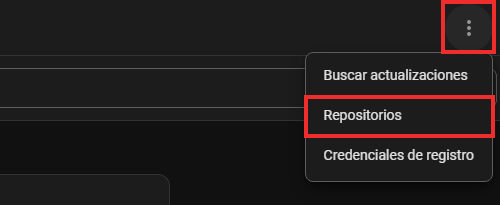

   Pega la dirección en el campo marcado y pulsa **Añadir**:

   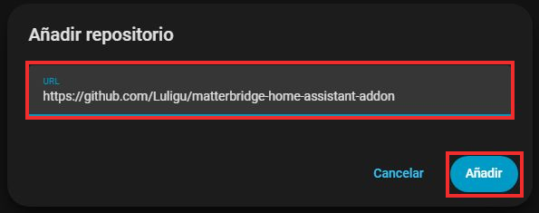

3. Busca **Matterbridge**, pulsa **Instalar** y espera. Activa **Iniciar al arrancar** para que funcione con el PC apagado. Pulsa **Iniciar** y **Abrir interfaz web**. El primer inicio puede tardar varios minutos; si aparece «La aplicación no está lista», espera y pulsa **Volver a intentar**.
4. Arriba verás **Home | Devices | Logs | Settings**. **Home** puede mostrar un QR o el botón **Turn on pairing**. Todavía no vincules nada.

**Comprueba:** la interfaz se abre y en **Home** aparece **Install plugins**. Si no, revisa el registro de la aplicación en Home Assistant.

## 3. Selecciona la red correcta

1. En otra pestaña de Home Assistant abre **Configuración > Sistema > Red**. Apunta el nombre de la interfaz principal que tiene la dirección de tu red doméstica. Puede ser `end0`, `eth0` u otro: no copies un ejemplo a ciegas.
2. Vuelve a Matterbridge, pulsa **Settings** arriba y busca **Matter settings > Mdns interface**. Escribe exactamente ese nombre. Guarda y reinicia Matterbridge si lo pide.

   Pulsa **Settings** y escribe el nombre de tu interfaz en **Mdns interface**; el campo aparece vacío en esta captura:

   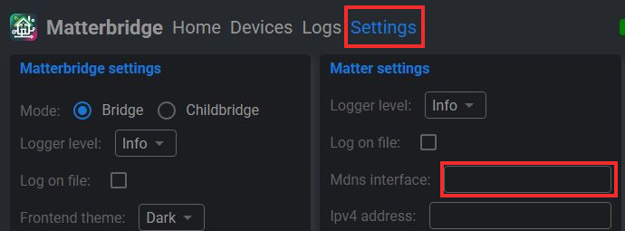

**Comprueba:** en **Home > System info**, **Interface name** corresponde a esa red. Si Matterbridge avisa de que falta **Mdns interface**, vuelve a **Settings** y corrígelo antes de vincular Alexa. Una red de invitados que aísle el Echo puede impedir la detección.

## 4. Marca solo el interruptor del PC

1. En Home Assistant abre **Configuración > Dispositivos y servicios > Entidades**. Busca el ID `switch.` del paso 1, abre la fila **Power** de tu PC y pulsa el icono **Configuración** de la entidad. No pulses el interruptor **Alternar**.
2. En los ajustes de **Power**, pulsa **Añadir etiqueta**. Si **no aparece** `WakeLink Alexa` en la lista, pulsa **Añadir nueva etiqueta...**, escribe `WakeLink Alexa` y pulsa **Crear**. Si ya aparece, no crees otra.

   **Solo si no existe**, pulsa **Añadir nueva etiqueta...**:

   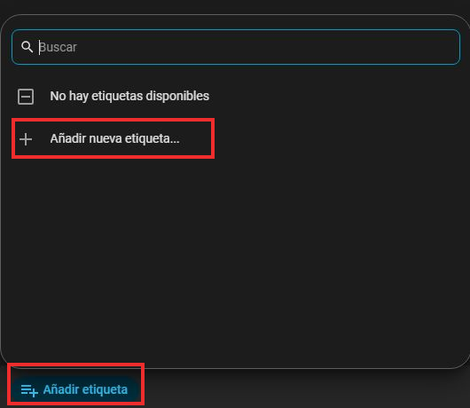

   Escribe exactamente este nombre en **Nombre** y pulsa **Crear**:

   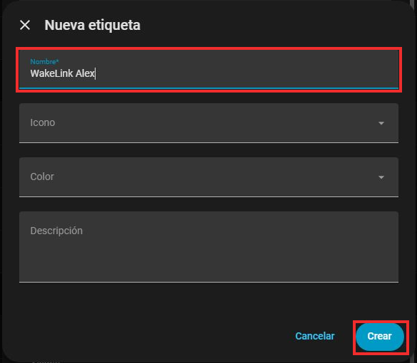

3. Mira junto a **Añadir etiqueta**. Si ya ves una pastilla **WakeLink Alexa**, pasa al paso 4. **Si no la ves**, abre **Añadir etiqueta** y pulsa la opción **WakeLink Alexa**. Crear la etiqueta no garantiza que quede asignada a **Power**; tampoco la pulses dos veces porque podrías desmarcarla.

   Si falta la pastilla, pulsa **WakeLink Alexa**, la opción marcada en rojo; **no** pulses **Añadir nueva etiqueta...** otra vez:

   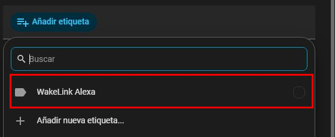

4. Comprueba que aparezca la pastilla **WakeLink Alexa** junto a **Añadir etiqueta**. Después pulsa **Actualizar** abajo; si no lo pulsas, el cambio no se guarda.

   Estos dos recortes son del mismo formulario: primero la pastilla, después **Actualizar**:

   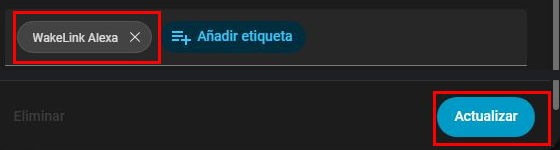

**Comprueba antes de seguir:** vuelve a **Entidades** y busca el PC. La fila **Power** debe mostrar **WakeLink Alexa** junto a su nombre. Si no aparece, repite los pasos 3 y 4; **no sigas a Matterbridge**. No apliques la etiqueta al dispositivo completo, a un área ni a otras entidades.

## 5. Instala el complemento y limita lo que exporta

1. En **Matterbridge > Home > Install plugins**, escribe `matterbridge-hass` en **Plugin name or plugin path**, deja **Tag or version** en `latest` y pulsa **Install**. Espera a que aparezca en **Plugins**. Puede indicar **Error** hasta que rellenes Host y Token; es normal. **No escanees el QR.**

   Escribe `matterbridge-hass` en el campo de la izquierda y pulsa **Install**:

   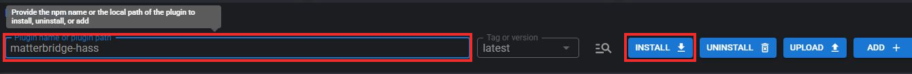

2. En Home Assistant pulsa tu usuario, abajo a la izquierda, y entra en **Seguridad > Tokens de acceso de larga duración > Crear token**. Llámalo, por ejemplo, `Matterbridge WakeLink`. Cópialo al crearlo. Es una clave con acceso amplio a Home Assistant: no la pongas en WakeLink, GitHub, capturas ni chats.

   Baja hasta **Tokens de acceso de larga duración** y pulsa **Crear token**. Hemos ocultado un token anterior en este recorte:

   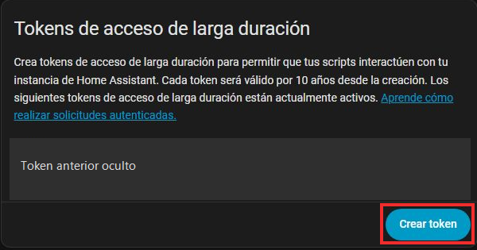

   Escribe un nombre y pulsa **Crear token**. Copia el token de la pantalla *siguiente*: no volverá a mostrarse:

   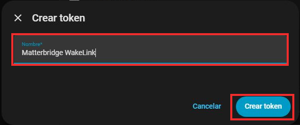

3. En la fila **Plugins** de `matterbridge-hass`, pulsa el **engranaje** de **Actions** para abrir **Plugin config**:

   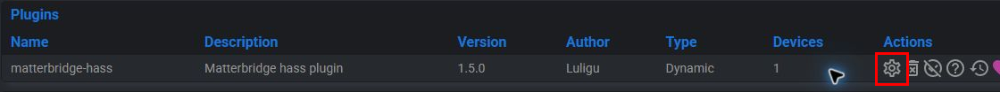

   En **Host** pon la dirección WebSocket de Home Assistant, normalmente `ws://homeassistant.local:8123` en una red privada de confianza. Pega la nueva clave en **Token**; nunca la incluyas en una captura. En esta imagen el campo Token está vacío a propósito:

   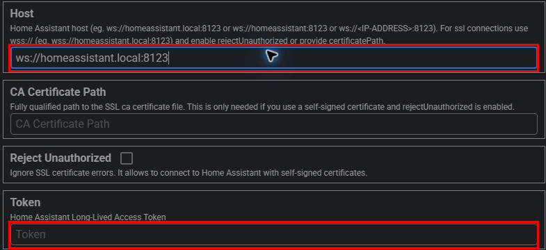

   `ws://` no cifra el token: úsalo solo en una red local de confianza. Si Home Assistant usa HTTPS con certificado válido, usa `wss://` con su nombre real y marca **Reject Unauthorized**. Un certificado propio necesita un **CA Certificate Path** de confianza. No desactives la comprobación del certificado para ocultar un error.
4. Baja hasta **Filter By Label** y escribe exactamente `WakeLink Alexa`:

   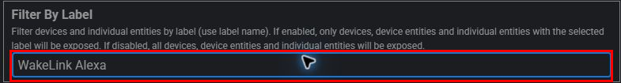

   En **Domain Whitelist**, abre la lista y selecciona **solo** `switch`:

   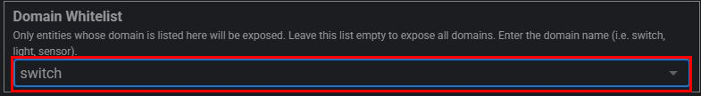

   Pulsa **Confirm** y después **Restart matterbridge** (botón de flecha circular en la barra superior); espera a que vuelva a abrir. No uses **Split Entities**. No dejes **Filter By Label** vacío: sin el, el complemento puede exportar otros dispositivos.
5. Abre **Matterbridge > Devices**. En **View mode**, arriba a la derecha, pulsa el **icono de tabla**:

   

   La tabla debe tener **una fila** de `matterbridge-hass`, con el nombre de tu PC, y mostrar **Total devices: 1**. En esta captura pública hemos ocultado el nombre real:

   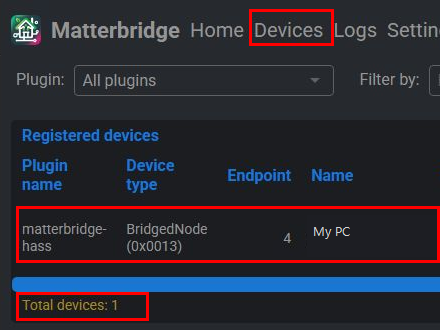

   En la vista de tarjetas, el *mismo PC* puede aparecer dos veces como **Online** y **On**; no son dos PC exportados. Si la tabla no tiene filas, revisa Host, Token y etiqueta. Si hay más de una, **no vincules Alexa**: corrige la etiqueta o el filtro.

**Comprobación obligatoria:** no vayas al QR hasta que la tabla muestre solo tu PC. Un filtro mal configurado puede exportar muchos dispositivos.

## 6. Vincula Matterbridge con Alexa

1. En Matterbridge abre **Home**. Si aparece **Turn on pairing**, púlsalo ahora; si no, ya verás **QR pairing code**. No es el código de seis cifras de WakeLink. No publiques el QR ni el código manual: alguien en tu red podría intentar vincular el puente.
2. En el móvil abre **Alexa > Dispositivos > + > Añadir dispositivo > Otro > Matter**. Confirma las preguntas y pulsa **Escanear código QR**. Escanea el QR de Matterbridge. Los textos pueden variar según la versión de Alexa; busca la opción **Matter**.
3. Espera a que Alexa encuentre el puente y el interruptor. Dale al PC un nombre claro, como **PC del despacho**. Si aparecen otros dispositivos de Home Assistant, elimina el puente de Alexa, corrige el filtro del paso 5 y no pruebes órdenes de voz.
4. Primero comprueba que el PC **aparece** en Alexa. Para probar el apagado, guarda tu trabajo y di «Alexa, apaga PC del despacho». Solo si Wake-on-LAN ya funciona desde Home Assistant, prueba «Alexa, enciende PC del despacho» con el PC apagado.

**Resultado esperado:** un solo PC en Alexa que responda a ambas órdenes. Acabar la guía no demuestra que esto funcione: hay que probarlo en un Echo real.

## Si falla o quieres deshacerlo

- **Matterbridge no está lista:** espera, pulsa **Volver a intentar** y, si persiste, revisa los registros de la aplicación en Home Assistant.
- **La tabla Devices no muestra filas:** primero vuelve al paso 4 y comprueba que la fila **Power** de Home Assistant muestre **WakeLink Alexa**; crear la etiqueta sin asignarla deja el filtro sin resultados. Si ya aparece, revisa Host/Token y el registro de `matterbridge-hass`. No quites **Filter By Label** para ocultar el problema.
- **La tabla Devices muestra más de una fila:** no escanees el QR. Quita etiquetas sobrantes o corrige **Filter By Label**, reinicia Matterbridge y vuelve a contar.
- **Alexa no lo encuentra:** revisa **Mdns interface**, la compatibilidad Matter del Echo y que Echo, móvil y Home Assistant puedan comunicarse localmente.
- **Alexa no enciende el PC:** prueba primero Wake-on-LAN desde Home Assistant. Matterbridge no puede cambiar la BIOS/UEFI ni el adaptador de red.
- **Deshacer:** elimina el puente Matterbridge de Alexa, desactiva/elimina `matterbridge-hass` y **revoca su token** en **Home Assistant > tu perfil > Seguridad**. Puedes quitar la etiqueta. Conserva el PC y la vinculación WakeLink. Restaurar una copia no revoca por sí solo el token ni borra el dispositivo de Alexa.

Fuentes: [aplicación Matterbridge](https://github.com/Luligu/matterbridge-home-assistant-addon/blob/main/DOCS.md), [configuración de `matterbridge-hass`](https://github.com/Luligu/matterbridge-hass/blob/main/README.md), [etiquetas en Home Assistant](https://www.home-assistant.io/docs/organizing/labels/), [Matter en Amazon](https://developer.amazon.com/docs/alexaplus/smarthome/matter-support.html).
