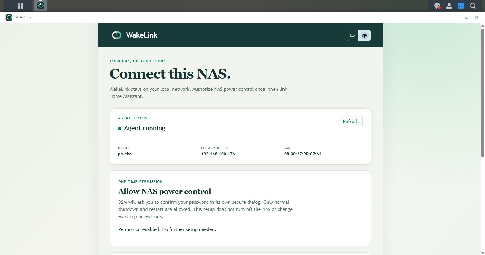

# Install WakeLink on Synology DSM

[English](INSTALL_DSM.en.md) | [Español](INSTALL_DSM.es.md) | [Choose another system](../README.md#start-here)

This controls **the NAS itself**, not a PC or a VM hosted on the NAS. You need DSM 7 with Python 3 available, an administrator account, and Home Assistant with HACS on the same trusted local network. Home Assistant must stay running elsewhere when this NAS is off. Alexa is configured afterwards.

**Test version:** these instructions require DSM package revision **`0021` or later** with the guided permission button. Older published packages may not have it. The user reported a successful fresh installation using this guide and working controls on the DSM 7.2 VM; sensor recovery after startup was checked. This does not validate every model: controlled restart, Wake-on-LAN on a physical NAS and package downgrade tests remain pending.

## Installation summary

1. Install WakeLink's `.spk` through **Package Center > Manual Install**.
2. Open WakeLink from the **HTTPS** DSM desktop using your administrator session.
3. Select **Authorize shutdown and restart**, confirm in DSM's dialog and wait for **Permission enabled**. This is an initial setup step; no SSH or manual task creation is needed.
4. Install WakeLink in HACS, restart Home Assistant and generate the pairing code in the DSM window.
5. Under Home Assistant's **Settings > Devices & services**, add the discovered NAS and enter that code. Its controls are ready to use.

**Already installed, authorized and paired? Do not repeat these steps.** Updating WakeLink does not require pairing again. The following sections explain each step and troubleshooting.

## 1. Download and prepare

Use **`pcpowerfree-dsm-noarch-0.2.0-0021.spk`** for this local test, not the Windows `.exe` or Ubuntu `.deb`. The old filename keeps upgrades compatible; the app is called WakeLink. This test build is not a new public release.

Keep the previous installer, a Home Assistant backup and a protected backup of WakeLink's state before updating. For a VM, use a verified hypervisor backup/snapshot. State backups contain credentials: never publish them. An older installer alone is not a guaranteed rollback.

## 2. Install and open WakeLink

1. Sign in to **your NAS's DSM desktop** using an administrator account and HTTPS. With default ports, use `https://YOUR_NAS_IP:5001/`.
2. Open **Package Center > Manual Install**, select the `.spk` and follow the wizard. If DSM warns that the package is unverified, check its source and decide whether to install it. Do not disable general protections.
3. Check that WakeLink is running in Package Center. If installation/startup says `python3 was not found`, resolve Python 3 availability before continuing; do not try to fix it with a pairing code.
4. Open **WakeLink** from DSM's applications menu. It opens inside the desktop, not in a separate tab.
5. Choose **EN**. You should see **Agent running**, the NAS name, IP and MAC.

WakeLink recognizes your DSM session automatically. Do not open its internal page directly. If a certificate warning appears, verify the NAS before deciding whether to proceed. `http://...:5001` is wrong: the HTTPS port requires **`https://`**.

## 3. Allow shutdown and restart once

1. In WakeLink, find **Allow NAS power control**.
2. If it already says **Permission enabled. No further setup needed.**, skip to section 4.
3. Otherwise, select **Authorize shutdown and restart**.
4. **DSM's own password confirmation dialog** opens. Confirm your current administrator password there. WakeLink does not provide a password form or save your password. Canceling leaves the permission unchanged.
5. Wait until WakeLink says **Permission enabled. No further setup needed.**

This is the result you should see (test VM, English interface):



**This does not shut down or restart anything.** It grants the agent only the two normal DSM power commands, not an administrator shell or arbitrary commands. No SSH is required for this guided setup. Installing the `.spk` alone does not grant the permission.

The setup briefly creates a disabled task named **WakeLink power setup ...** in DSM's Task Scheduler, runs only the protected permission helper, then removes the task. This relies on DSM's native client interfaces and needs compatibility testing on other DSM versions.

If setup fails, select **Refresh** first. If a disabled **WakeLink power setup ...** task remains under **Control Panel > Task Scheduler**, remove only that task before trying again. Keep the displayed error code, but never share passwords or pairing codes. Do not modify unrelated tasks.

## 4. Link Home Assistant

**Already linked? Skip this section.** Updating does not require a new code or deleting the NAS in Home Assistant.

[](https://my.home-assistant.io/redirect/hacs_repository/?owner=slx612&repository=WOL-Home-Assistant-And-Alexa&category=integration)

HACS must already be installed and configured. The button opens WakeLink's card, not an automatic installation. Check the Home Assistant address before selecting **Open link**. If asked for your instance URL, enter the address you normally use to open Home Assistant, such as `http://homeassistant.local:8123`. Sign in to your Home Assistant if requested.

1. Use the button above, or in Home Assistant open **HACS**, search for `WakeLink`, open its card and select **Download**. Choose the release you want to test; enable HACS's beta-version option if needed. Restart Home Assistant when prompted. If it is missing, use **... > Custom repositories**, enter `https://github.com/slx612/WOL-Home-Assistant-And-Alexa`, choose **Integration**, select **Add** and search again. Install the integration only once. You do not need the Windows app.
2. In WakeLink's DSM window, select **Generate pairing code**.
3. In Home Assistant, open **Settings > Devices & services** and select the discovered NAS. If missing, select **Add integration > WakeLink**.
4. Check its name and IP, then enter the six-digit code within ten minutes. If asked for an IP/port, use the NAS address and `58477`, unless you changed the agent port.
5. Check that the NAS appears under WakeLink with **Power**, **Restart**, **Boot time** and **Uptime**. The HACS list may still lack an icon because of a [known display issue](KNOWN_ISSUES.md#english); installation can still succeed.

**Checkpoint:** the NAS is paired, and the DSM window says **Permission enabled**. Home Assistant shows a TLS fingerprint while pairing; verify the intended NAS name/IP and pair only on the trusted network. This DSM preview does not yet display that fingerprint for side-by-side comparison.

### What the sensors show

- **Boot time:** the date and time of the system's last boot, not the duration of startup.
- **Uptime:** time since that boot, not since you opened the WakeLink window.

When the NAS is off or the agent is not responding yet during startup, both show **Unavailable**. They recover automatically on a later Home Assistant poll once the agent is reachable (30 seconds by default, configurable in WakeLink options). This temporary state does not require a new code, another permission grant or reinstallation.

## 5. Test power only when ready

1. Finish backups, transfers and other work. Verify that you selected the correct NAS.
2. Turn **that NAS's** switch off in Home Assistant. **This is a real shutdown request.**
3. Check that it shuts down correctly. If DSM refuses because a critical operation is running, do not force shutdown.
4. Waking needs a supported Synology model with Wake-on-LAN enabled. In DSM, open **Control Panel > Hardware & Power > General**, enable **WOL** for the connected LAN interface and save. If the option is absent, check the model's support; see [Synology's instructions](https://kb.synology.com/en-us/DSM/help/DSM/AdminCenter/system_hardware_general?version=7). Keep the NAS plugged into power. WakeLink cannot start a stopped DSM VM through its hypervisor.

Use **Restart** only when a real NAS restart is intended. It is not a refresh button.

Only **normal, immediate** shutdown/restart is supported, not force or a delay. Do not use this beta on a Synology High Availability cluster: native power commands may affect both nodes. When Home Assistant works, follow the [Alexa guide](ALEXA.en.md). Matterbridge cannot fix a missing DSM power permission.

## Update or revoke permission

Use **Manual Install** to install a newer `.spk` over WakeLink. Do not uninstall, delete the Home Assistant device or generate another code just to update. State and TLS identity are preserved. Check the permission again after a DSM system update.

Advanced removal currently requires an administrator SSH connection to the correct NAS. Run this **before uninstalling WakeLink**:

```sh
sudo /usr/bin/python3 -I /var/packages/pcpowerfree/conf/power_permissions.py --remove
```

It revokes the grant without shutting down the NAS. Use only the root-protected `conf` helper, not a copy under `target/app`. For SSH access, see [Synology's instructions](https://kb.synology.com/en-us/DSM/tutorial/How_to_login_to_DSM_with_root_permission_via_SSH_Telnet).

To roll back, use a verified state-preserving backup. If DSM rejects the older installer, **do not uninstall to force it**: stop and prepare a restore.

For shared network, HACS update and rollback questions, see [Help and updates](HELP.en.md). No Home Assistant backup covers a separate NAS's package state by itself.

## Common messages

| Message | What to do |
| --- | --- |
| `DSM power permission is not enabled` | Complete section 3 in WakeLink's HTTPS desktop window. |
| No authorization button | Check your installed package revision; older published builds lack the guided setup. |
| Administrator session required | Sign in to the DSM desktop as an administrator and open WakeLink from its menu. |
| `400 Bad Request` opening DSM | Use `https://` on the HTTPS port, not `http://...:5001`. |
| Setup failed with a DSM code | Refresh, check for the temporary task as described in section 3 and report only the code. |
