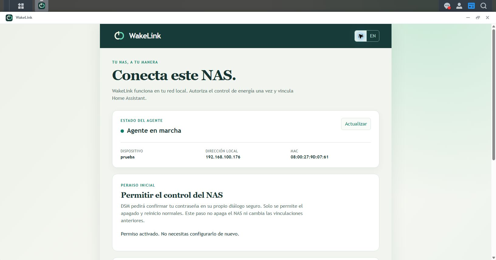

# Instalar WakeLink en Synology DSM

[English](INSTALL_DSM.en.md) | [Español](INSTALL_DSM.es.md) | [Elegir otro sistema](README.es.md#empieza-aquí)

Esto controla **el propio NAS**, no un PC ni una VM alojada en él. Necesitas DSM 7 con Python 3 disponible, una cuenta administradora y Home Assistant con HACS en la misma red local de confianza. Home Assistant debe seguir encendido en otro equipo cuando apagues este NAS. En Home Assistant, **Configuración** puede llamarse **Ajustes** en algunas versiones. Alexa se configura después.

**Versión de pruebas:** estas instrucciones necesitan un paquete DSM de revisión **`0021` o posterior**, con el botón de autorización guiada. Los paquetes antiguos publicados pueden no incluirlo. El usuario ha comunicado una instalación limpia correcta siguiendo esta guía y controles funcionales en la VM DSM 7.2; se ha comprobado la recuperación de los sensores tras arrancar. Esto no valida todos los modelos: faltan pruebas controladas de reinicio, Wake-on-LAN en un NAS físico y regreso a un paquete anterior.

## Resumen de la instalación

1. Instala el `.spk` de WakeLink desde **Centro de paquetes > Instalación manual**.
2. Abre WakeLink desde el escritorio **HTTPS** de DSM con tu sesión administradora.
3. Pulsa **Autorizar apagado y reinicio**, confirma en el diálogo de DSM y espera a **Permiso activado**. Solo se hace inicialmente; no necesitas SSH ni crear tareas a mano.
4. Instala WakeLink en HACS, reinicia Home Assistant y genera el código de vinculación en la ventana DSM.
5. En **Configuración > Dispositivos y servicios** de Home Assistant, añade el NAS descubierto e introduce ese código. Ya puedes usar sus controles.

**Si ya está instalado, autorizado y vinculado, no repitas estos pasos.** Actualizar WakeLink no exige volver a vincularlo. Los apartados siguientes explican cada paso y cómo resolver problemas.

## 1. Descargar y preparar

Usa **`pcpowerfree-dsm-noarch-0.2.0-0021.spk`** para esta prueba local, no el `.exe` de Windows ni el `.deb` de Ubuntu. El nombre antiguo del archivo mantiene la compatibilidad al actualizar; la app se llama WakeLink. Esta prueba todavía no es una publicación nueva.

Antes de actualizar, conserva el instalador anterior, una copia de Home Assistant y una copia protegida del estado de WakeLink. Para una VM, utiliza una copia o instantánea verificada del hipervisor. El estado contiene credenciales: no lo publiques. El instalador anterior, por sí solo, no garantiza poder volver atrás.

## 2. Instalar y abrir WakeLink

1. Entra en **el escritorio DSM de tu NAS** como administrador y por HTTPS. Con los puertos predeterminados, usa `https://IP_DE_TU_NAS:5001/`.
2. Abre **Centro de paquetes > Instalación manual**, elige el `.spk` y sigue el asistente. Si DSM avisa de que el paquete no está verificado, revisa su origen y decide si aceptas instalarlo. No desactives protecciones generales.
3. Comprueba que WakeLink está en marcha en el Centro de paquetes. Si al instalar/arrancar aparece `python3 was not found`, resuelve la disponibilidad de Python 3 antes de continuar; no se arregla con un código de vinculación.
4. Abre **WakeLink** desde el menú de aplicaciones de DSM. Se abre dentro del escritorio, no en otra pestaña.
5. Elige **ES**. Debe aparecer **Agente en marcha**, con el nombre, IP y MAC del NAS.

WakeLink reconoce automáticamente tu sesión de DSM. No abras su página interna directamente. Si aparece una advertencia de certificado, comprueba el NAS antes de decidir si continúas. `http://...:5001` no sirve: ese puerto requiere **`https://`**.

## 3. Permitir apagado y reinicio una sola vez

1. En WakeLink, busca **Permitir el control del NAS**.
2. Si ya pone **Permiso activado. No necesitas configurarlo de nuevo.**, pasa al apartado 4.
3. Si no, pulsa **Autorizar apagado y reinicio**.
4. Se abre **el diálogo de confirmación de contraseña del propio DSM**. Confirma ahí tu contraseña administradora actual. WakeLink no tiene un formulario de contraseña ni la guarda. Si cancelas, el permiso queda como estaba.
5. Espera hasta que WakeLink muestre **Permiso activado. No necesitas configurarlo de nuevo.**

Este es el resultado que debes ver (VM de pruebas, interfaz en español):



**Este paso no apaga ni reinicia nada.** Solo permite al agente ejecutar las dos órdenes normales de energía de DSM: no concede una consola administradora ni órdenes arbitrarias. Para este asistente no necesitas SSH. Instalar el `.spk`, por sí solo, no concede el permiso.

Durante la autorización se crea una tarea deshabilitada llamada **WakeLink power setup ...** en el Programador de tareas de DSM. Ejecuta únicamente el auxiliar protegido de permisos y después se elimina. El asistente utiliza funciones del cliente nativo DSM que necesitan pruebas de compatibilidad en otras versiones.

Si falla, pulsa primero **Actualizar**. Si queda una tarea deshabilitada **WakeLink power setup ...** en **Panel de control > Programador de tareas**, elimina solo esa tarea antes de repetir. Guarda el código de error que aparezca, pero nunca compartas contraseñas ni códigos de vinculación. No cambies otras tareas.

## 4. Vincular Home Assistant

**¿Ya estaba vinculado? Salta este apartado.** Actualizar no exige otro código ni borrar el NAS en Home Assistant.

[](https://my.home-assistant.io/redirect/hacs_repository/?owner=slx612&repository=WOL-Home-Assistant-And-Alexa&category=integration)

HACS debe estar instalado y configurado. El botón abre la ficha de WakeLink: no lo instala automáticamente. Comprueba la dirección de Home Assistant antes de pulsar **Open link** (abrir enlace). Si pide la dirección de tu instancia, introduce la que usas normalmente para abrir Home Assistant, por ejemplo `http://homeassistant.local:8123`. Inicia sesión en tu Home Assistant si lo solicita.

1. Usa el botón anterior o en Home Assistant abre **HACS**, busca `WakeLink`, entra en su ficha y pulsa **Descargar**. Elige la publicación que quieres probar; activa la opción HACS de mostrar betas si hace falta. Reinicia Home Assistant cuando lo pida. Si falta, usa **... > Repositorios personalizados**, introduce `https://github.com/slx612/WOL-Home-Assistant-And-Alexa`, elige **Integración**, pulsa **Añadir** y busca de nuevo. Instala la integración una sola vez. No necesitas el programa Windows.
2. En la ventana DSM de WakeLink, pulsa **Generar código de vinculación**.
3. En Home Assistant, abre **Ajustes > Dispositivos y servicios** y selecciona el NAS descubierto. Si no aparece, pulsa **Añadir integración > WakeLink**.
4. Comprueba el nombre y la IP e introduce el código de seis cifras antes de diez minutos. Si pide IP/puerto, usa los del NAS y `58477`, salvo que hayas cambiado el puerto del agente.
5. Comprueba que el NAS aparece con **Power**, **Restart**, **Boot time** y **Uptime** (pueden mantener nombres ingleses). Si falta el icono en la lista HACS, es un [problema visual conocido](KNOWN_ISSUES.md#espanol); no impide instalar.

**Comprueba:** el NAS está vinculado y la ventana DSM pone **Permiso activado**. El formulario Home Assistant muestra la huella TLS; verifica nombre/IP y vincula solo en la red de confianza. Esta prueba DSM todavía no muestra esa huella para compararla lado a lado.

### Qué muestran los sensores

- **Boot time:** fecha y hora del último arranque del sistema; no mide cuánto tarda en arrancar.
- **Uptime:** tiempo que lleva encendido desde ese arranque; no desde que abriste la ventana de WakeLink.

Cuando el NAS está apagado o el agente todavía no responde durante el arranque, ambos aparecen como **No disponible**. Se recuperan automáticamente en una consulta posterior cuando el agente vuelve a estar accesible (30 segundos por defecto, ajustable en las opciones WakeLink). No necesitas generar otro código, reautorizar ni reinstalar por ese estado temporal.

## 5. Probar la energía cuando estés preparado

1. Termina copias, transferencias y otros trabajos. Comprueba que has seleccionado el NAS correcto.
2. Apaga el interruptor de **ese NAS** en Home Assistant. **Esta vez sí es una orden de apagado real.**
3. Comprueba que se apaga correctamente. Si DSM rechaza la orden porque hay una operación crítica, no fuerces el apagado.
4. El encendido requiere un modelo Synology compatible y Wake-on-LAN habilitado. En DSM abre **Panel de control > Hardware y alimentación > General**, activa **WOL** en la interfaz LAN conectada y guarda. Si falta la opción, comprueba la compatibilidad del modelo: [instrucciones de Synology](https://kb.synology.com/es-mx/DSM/help/DSM/AdminCenter/system_hardware_general?version=7). Mantén el NAS conectado a la corriente. WakeLink no arranca una VM DSM apagada mediante su hipervisor.

Pulsa **Restart** solo cuando quieras reiniciar realmente el NAS. No es un botón para refrescar.

Solo se admite apagado/reinicio **normal e inmediato**, sin modo forzado ni retraso. No uses esta beta en un clúster Synology High Availability: las órdenes nativas pueden afectar a ambos nodos. Cuando Home Assistant funcione, sigue la [guía de Alexa](ALEXA.es.md). Matterbridge no resuelve la falta de permisos de energía en DSM.

## Actualizar o retirar el permiso

Instala el `.spk` nuevo encima de WakeLink mediante **Instalación manual**. No desinstales, no borres el dispositivo de Home Assistant ni generes otro código solo para actualizar. Se conservan el estado y la identidad TLS. Vuelve a comprobar el permiso después de una actualización del sistema DSM.

La retirada avanzada todavía necesita una conexión SSH administradora al NAS correcto. Ejecuta esto **antes de desinstalar WakeLink**:

```sh
sudo /usr/bin/python3 -I /var/packages/pcpowerfree/conf/power_permissions.py --remove
```

Retira el permiso sin apagar el NAS. Usa solo el auxiliar protegido de `conf`, no una copia bajo `target/app`. Para acceder por SSH, consulta las [instrucciones de Synology](https://kb.synology.com/es-mx/DSM/tutorial/How_to_login_to_DSM_with_root_permission_via_SSH_Telnet).

Para volver atrás, usa una copia verificada que conserve el estado. Si DSM rechaza el instalador anterior, **no desinstales para forzarlo**: detente y prepara una restauración.

Para dudas comunes de red, actualización HACS y restauración, consulta [Ayuda y actualizaciones](HELP.es.md). Una copia Home Assistant por sí sola no respalda el estado del paquete de un NAS independiente.

## Mensajes habituales

| Mensaje | Qué hacer |
| --- | --- |
| `DSM power permission is not enabled` | Completa el apartado 3 desde la ventana del escritorio HTTPS. |
| No hay botón de autorización | Comprueba la revisión instalada; los paquetes antiguos publicados no tienen el asistente. |
| Se necesita sesión administradora | Entra en el escritorio DSM como administrador y abre WakeLink desde su menú. |
| `400 Bad Request` al entrar en DSM | Usa `https://` en el puerto HTTPS, no `http://...:5001`. |
| Fallo de autorización con código DSM | Actualiza, busca la tarea temporal según el apartado 3 e informa solo del código. |
